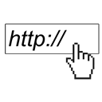

# UrlPicker for Umbraco v7 #

Originally built during uWestFest 2014 and released on NuGet only. Now available to non-Nugeteers.

Authored by Tom Fulton, Kevin Giszewski, Jeavon Leopold, Bjarne Fyrstenborg and others.

If using v0.15.x+ with Umbraco Core 7.2.8 and lower, please note you will need to merge translation keys manually into the language file of choice.

v0.16.0 contains an (un)breaking change as the value converter will now return either a `UrlPicker` object or a `IEnumerable<UrlPicker>` depending on if the developer has set UrlPicker to multiple mode in the data type prevalues

## Installation ##

Both NuGet and Umbraco packages are available. 

|NuGet Packages    |Version           |
|:-----------------|:-----------------|
|**Release**|
|**Pre-release**|

|Umbraco Packages  |                  |
|:-----------------|:-----------------|
|**Release**| 
|**Pre-release**| 

## Usage ##

Examples available in the [Wiki](https://github.com/kgiszewski/uWestFest/wiki/Usage)